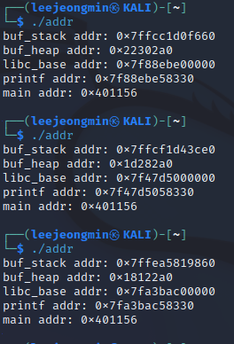

<head>
  <style>
    table.dataframe {
      white-space: normal;
      width: 100%;
      height: 240px;
      display: block;
      overflow: auto;
      font-family: Arial, sans-serif;
      font-size: 0.9rem;
      line-height: 20px;
      text-align: center;
      border: 0px !important;
    }

    table.dataframe th {
      text-align: center;
      font-weight: bold;
      padding: 8px;
    }

    table.dataframe td {
      text-align: center;
      padding: 8px;
    }

    table.dataframe tr:hover {
      background: #b8d1f3; 
    }

    .output_prompt {
      overflow: auto;
      font-size: 0.9rem;
      line-height: 1.45;
      border-radius: 0.3rem;
      -webkit-overflow-scrolling: touch;
      padding: 0.8rem;
      margin-top: 0;
      margin-bottom: 15px;
      font: 1rem Consolas, "Liberation Mono", Menlo, Courier, monospace;
      color: $code-text-color;
      border: solid 1px $border-color;
      border-radius: 0.3rem;
      word-break: normal;
      white-space: pre;
    }

  .dataframe tbody tr th:only-of-type {
      vertical-align: middle;
  }

  .dataframe tbody tr th {
      vertical-align: top;
  }

  .dataframe thead th {
      text-align: center !important;
      padding: 8px;
  }

  .page__content p {
      margin: 0 0 0px !important;
  }

  .page__content p > strong {
    font-size: 0.8rem !important;
  }

  </style>
</head>


지난 과거에서부터 공격 및 보호 기법의 발전 양상을 보면 알 수 있듯이,


어떤 보호 기법이 등장하면 이를 우회하는 새로운 공격 기법이 등장하고,


이러한 공격 기법을 막기 위해 다시 새로운, 더 좋은 보호 기법이 등장하였다.


어느 공격 기법이 등장할 지는 예측이 불가능하기 때문에 시스템 개발자들은 여러 겹의 보호 기법을 적용하여 시스템이 공격당할 수 있는 부분 자체를 줄여가려고 노력하였다.


예를 들어, 전에 했던 r2s를 대상으로 셸 코드를 실행시킬 수 있었던 이유는 다음과 같다.


- 반환 주소를 임의로 덮을 수 있다.


- 버퍼의 주소를 알 수 있었다.


- 해당 버퍼가 실행이 가능하였다.


위의 3가지 조건 중 첫 번째 조건을 만족시키기 어렵게 하기 위하여 카나리 기법을 도입하였으나, 나머지 두 조건을 보호하지 않았기에 카나리 우회를 통하여 익스플로잇을 진행하였었다.


결국 익스플로잇에 어려움을 주기 위하여 메모리에서 임의 버퍼 주소를 알기 어렵게 만들고, 메모리 영역에서 불필요한 실행 권한을 제거하는 기법을 도입하여야 하는데, 이를 위해 ASLR과 NX가 개발 된 것이다.


## ASLR


바이너리가 실행될 때마다 스택, 힙, 공유 라이브러리등을 임의의 주소에 할당하는 보호 기법이다.


ASLR은 커널에서 지원하는 보호 기법이며 다음과 같이 확인할 수 있다.


```bash

$ cat /proc/sys/kernel/randomize_va_space

2

```


리눅스에서 이 값은 0,1,2를 가질 수 있다.


각각의 ASLR이 적용되는 메모리 영역은 다음과 같다.


0 : No ASLR


    ASLR을 적용하지 않음


1 : Conservative Randomization


    스택, 힙, 라이브러리, vdso 등


2 : Conservative Randomization + brk


    (1)의 영역과 brk로 할당한 영역


다음 예제를 통해 ASLR의 특징을 살펴보자.


먼저 C 코드는 다음과 같다.


```c

#include <dlfcn.h>

#include <stdio.h>

#include <stdlib.h>

int main() {

  char buf_stack[0x10];                   // 스택 버퍼

  char *buf_heap = (char *)malloc(0x10);  // 힙 버퍼


  printf("buf_stack addr: %p\n", buf_stack);

  printf("buf_heap addr: %p\n", buf_heap);

  printf("libc_base addr: %p\n",

         *(void **)dlopen("libc.so.6", RTLD_LAZY));  // 라이브러리 주소

         

  printf("printf addr: %p\n",

         dlsym(dlopen("libc.so.6", RTLD_LAZY),

               "printf"));  // 라이브러리 함수의 주소

  printf("main addr: %p\n", main);  // 코드 영역의 함수 주소

}

```


**컴파일**


```bash

$ gcc addr.c -o addr -ldl -no-pie -fno-PIE

```


### 특징


addr.c 코드를 살펴보면, 메모리의 주소를 출력하는 코드이다.


컴파일 후 실행하면 다음과 같은 결과를 볼 수 있다.




스택 영역의 buf_stack, 힙 영역의 buf_heap, 라이브러리 매핑 주소 libc_base 라이브러리 함수 printf, 코드 영역의 함수 main이 출력되었다.


결과를 살펴보면 다음과 같은 특징이 있다.


- 코드 영역의 함수 main을 제외한 다른 영역의 주소들은 실행할 때마다 변경된다. 실행할 때마다 주소가 변경되기 때문에 바이너리를 실행하기 전 해당 영역의 주소를 예측할 수 없다.


- 바이너리를 반복해서 실행해도 libc_base 주소 하위 12비트 값과 printf 주소 하위 12비트 값은 변경되지 않는다. ASLR이 적용됬을 때, 파일을 페이지(page) 단위로 임의의 주소로 매핑하기 때문에, 페이지 크기인 12비트 이하로는 주소가 변경되지 않는 것이다.


- libc_base와 printf의 주소 차이는 항상 같다. ASLR이 적용되면, 라이브러리는 임의 주소에 매핑된다. 그러나 라이브러리 파일을 그대로 매핑하는 것이기에 매핑된 주소로부터 라이브러리의 다른 심볼들 까지의 거리는 항상 같다.


## NX


실행에 사용되는 메모리 영역과 쓰기에 사용되는 메모리 영역을 분리하는 보호 기법이다.


어떤 메모리 영역에 쓰기 권한과 실행 권한이 같이 있으면 시스템이 취약해지기 쉽다.


예를 들어, 코드 영역에 쓰기 권한이 있으면 공격자는 코드를 수정하여 원하는 코드가 실행될 수 있게 할 수 있고, 반대로 스택이나 데이터 영역에 실행 권한이 있으면 Return to Shellcode와 같은 공격을 시도할 수 있다.


CPU가 NX를 지원하면 컴파일러 옵션을 통해 바이너리에 NX를 적용할 수 있으며, 적용된 바이너리는 실행될 때 각 메모리 영역에 필요한 권한만을 부여받는다.


gdb의 vmmap으로 NX 적용 전후의 메모리 맵을 비교하면, NX가 적용된 바이너리에는 코드 영역 외에 실행 권한이 없고, NX가 적용되지 않은 바이너리의 경우, 스택 영역에 실행 권한이 존재하여 rwx권한을 가진다.


다음과 같은 명령어를 이용하여 바이너리에 NX가 적용되었는지 뿐만 아니라 다른 보호기법이 어떤 것이 사용되었는지 확인할 수 있다.


```bash

$ checksec --file=[파일 경로]

```


위의 결과를 확인하면 다음과 같이 나온다.


확인하는 바와 같이 NX가 활성화 되어 있고, 해당 바이너리를 대상으로 익스플로잇 코드를 실행하면, Segmentation fault가 발생한다.


이는 NX가 적용되어 스택 영역에 실행 권한이 사라지게 되면서, 셸코드가 실행되지 못하고 종료되는 것이다.


## 정리


NX와 ASLR이 적용되면 스택, 힙, 데이터 영역에는 실행 권한이 제거되며, 이들이 할당되는 주소는 계속해서 변한다.


하지만 바이너리의 코드가 존재하는 영역은 실행 권한이 존재하며, 할당되는 주소도 고정되어 있다.


코드 영역에 유용한 코드 가젯, 함수들이 포함되어 있기에, 반환 주소를 셸 코드로 직접 덮는 대신에, NX와 ASLR을 우회하여 공격하는 RTL(Return-to-Libc)과 ROP(Return Oriented Progrmmimg)을 이용한다.

